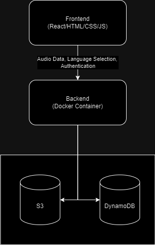

# Wav2VecNigeria: An ASR System for Nigerian Languages

This repository houses the development of **Wav2VecNigeria**, a web application designed to transcribe audio in multiple languages, with a particular focus on low-resource Nigerian languages. 

## Example System Architecture Diagram

## Simplifying for MVP (Minimum Viable Product)

To expedite the launch of a functional MVP, consider focusing on these core features:

*   **Essential UI:** Implement audio upload/recording, language selection (English + 1-2 Nigerian languages), and transcription display.
*   **Streamlined Backend:** Develop a single Dockerized Flask API to handle audio processing, user authentication, and data storage (with consent).
*   **Firebase Integration:** Leverage Firebase for user authentication, audio storage (if consent is given), and potentially database services.

This simplified approach allows for a quicker launch, gathering user feedback and iterating on features and language support in future development phases.